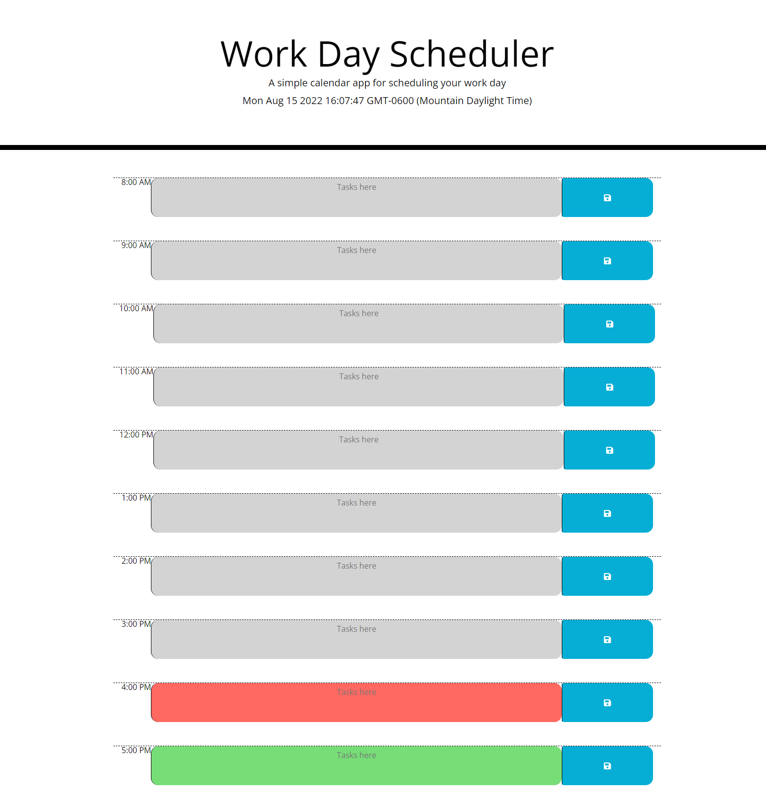

# scheduler-application

## DEscription

This is a scheduling application that tracks the hours in a standard work day. It allows the user to enter data and events for any of the hours during the day as well as save that information to the local storage so that upon reload all of the data is still there. It also shows which hours have already passed or are to come in color.

[Work Day Scheduler](https://tatefoster.github.io/scheduler-application/)

